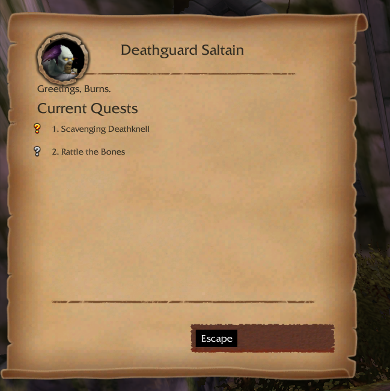
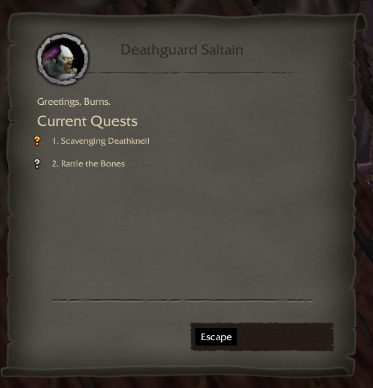
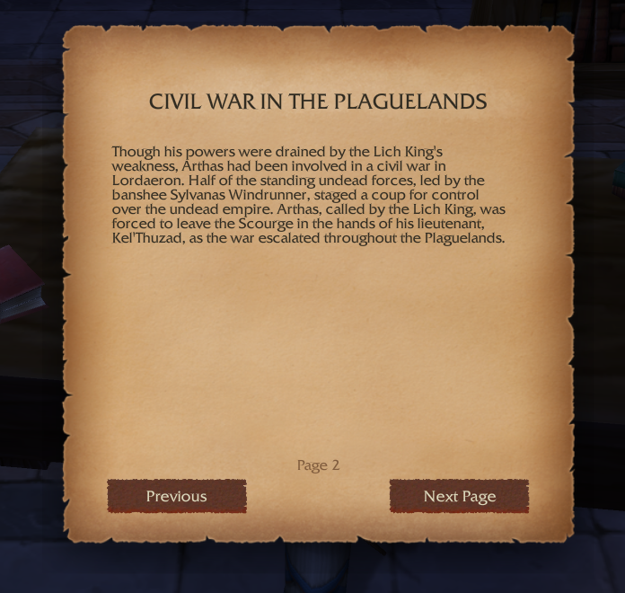

# DialogUI (WotLK 3.3.5a)

An immersive quest / gossip / book dialog UI for **WoW 3.3.5a (WotLK)**.

This is a **3.3.5a port** of [Sxus's DialogUI](https://github.com/Jslquintero/DialogUI)
(originally a Vanilla 1.12.1 addon), reworked and extended to run on the WotLK client.

**Credits**
- Original author: **Sxus** — https://github.com/Jslquintero/DialogUI
- WotLK 3.3.5a port & additional features: **Bset**
- Visual inspiration: [DialogueUI](https://www.curseforge.com/wow/addons/dialogueui)

---

## Screenshots

| Light mode | Dark mode |
|:---:|:---:|
|  |  |

**Book mode** (immersive reader with focus dimmer)

---

Disclaimer:
This addon was created primarily as a learning project to explore WoW addon development.
It is provided as-is, without warranty or support.
The author is not responsible for any issues, including errors, data loss, or usage on any public or private servers.
Use at your own risk.

Users are welcome to use, modify, or explore the code for educational purposes.
Redistribution is allowed, but the author assumes no responsibility for any consequences.

This addon is designed for WoW Vanilla 1.12.1. Compatibility with other versions or custom servers is not guaranteed.

# Customize it!

Feel free to add/remove icons or change the frame background completely, every image is now Truevision Graphics Adapter (TGA) format.

I recommend using Gimp 3 with [Batcher](https://kamilburda.github.io/batcher/) to quickly export your new files.

To change the gossip icons you can go to :

> DialogUI/src/assets/art/icons/GossipIcons.xcf

To change the style of the buttons or of the frame :

> DialogUI/src/assets/art/parchment/ParchmentLayout.xcf

---

# Downported features (from the modern DialogueUI)

These were backported from the retail DialogueUI to 3.3.5a:

- **Most-valuable reward coin.** When a quest lets you choose between several reward
  items, a small gold coin is pinned to the one worth the most to a vendor — handy
  for spotting the best vendor-fodder pick at a glance. (Uses the `sellPrice` return
  of `GetItemInfo`, which exists on 3.3.5a.)

- **Light / Dark mode.** A real dark theme: in dark mode the frame swaps to dedicated
  dark parchment / option / reward textures (generated from the addon's own art, so the
  layout matches exactly) and the text flips to light. Toggle it from the in-game options
  (**Esc > Interface > AddOns > DialogUI > Dark mode**) or with a slash command — state is
  saved account-wide:

  > `/dialogui dark` &nbsp;|&nbsp; `/dialogui light` &nbsp;|&nbsp; `/dialogui` (toggle)
  >
  > `/dui` is an alias.

  The dark textures are `*-Dark.tga` in `src/assets/art/parchment/`; regenerate them from
  the light originals if you restyle the frame.

- **Book mode.** Readable books, letters, signs and plaques open in a dedicated
  reader with its own look — a centered, bound parchment leaf over a dimmed screen,
  distinct from the side quest/gossip frames — with Previous / Next page navigation
  (Space turns the page, Esc or clicking the dimmed area closes). Respects the
  light/dark theme (its own dark page art included).

- **Auto-advance (optional, off by default).** Skims trivial NPCs: when one is
  presenting only a single gossip option or a single quest, it advances
  automatically, and it auto-finishes a turn-in that has no reward choice to make.
  It never auto-*accepts* a new quest.

- **Text size & font.** Scale the dialogue text (0.8–1.4×) and optionally switch to
  a narrow font, for readability.

- **Frame scale & side.** Resize the whole frame (0.8–1.3×) and anchor it to the
  left or right edge of the screen.

- **Animation toggle.** Turn the quest-text typewriter / fade on or off.

All of the above live in an in-game options panel: **Esc > Interface > AddOns >
DialogUI**. Settings are saved account-wide.

---

# Español

Disclaimer:
Este addon fue creado principalmente como un proyecto de aprendizaje para explorar el desarrollo de addons de WoW.
Se proporciona como-está, sin garantía ni soporte.
El autor no es responsable de ningún problema, incluyendo errores, pérdida de datos o uso en cualquier servidor público o privado.
Usar bajo su propio riesgo.

Los usuarios son bienvenidos a usar, modificar o explorar el código para fines educativos.
La redistribución está permitida, pero el autor asume ninguna responsabilidad por consecuencias.

Este addon es diseñado para WoW Classic 1.12.1. La compatibilidad con otras versiones no está garantizada.

[DialogueUI](https://www.curseforge.com/wow/addons/dialogueui) fue obviamente mi inspiración.

# ¡Perzonalizar!

Sientete libre de agregar/iconos o cambiar el fondo del panel completamente, cada imagen esta ahora en formato Truevision Graphics Adapter (TGA)

Recomiendo utilizar Gimp 3 con el plugin [Batcher](https://kamilburda.github.io/batcher/) para exportar rápidamente los archivos.

Para cambiar los iconos de los dialogos puedes dirigirte a :

> DialogUI/src/assets/art/icons/GossipIcons.xcf

Para cambiar el estilo de los botones puedes dirigirte a :

> DialogUI/src/assets/art/parchment/ParchmentLayout.xcf

<h3>Gallery</h3>

[DialogueUI](https://www.curseforge.com/wow/addons/dialogueui) was obviously the inspiration for this new look.
